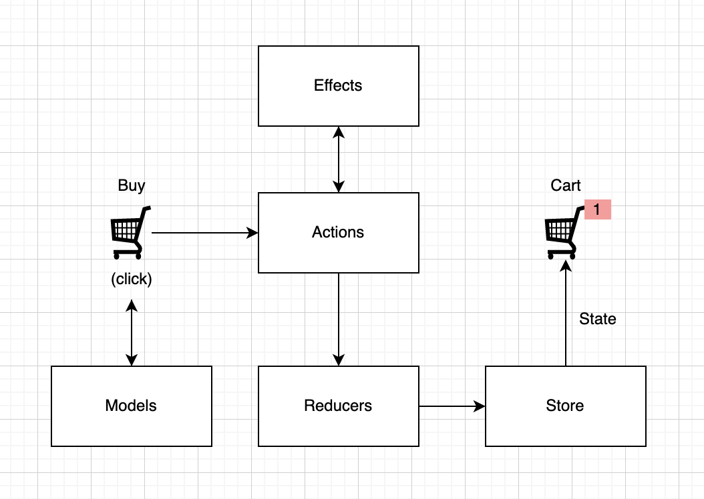
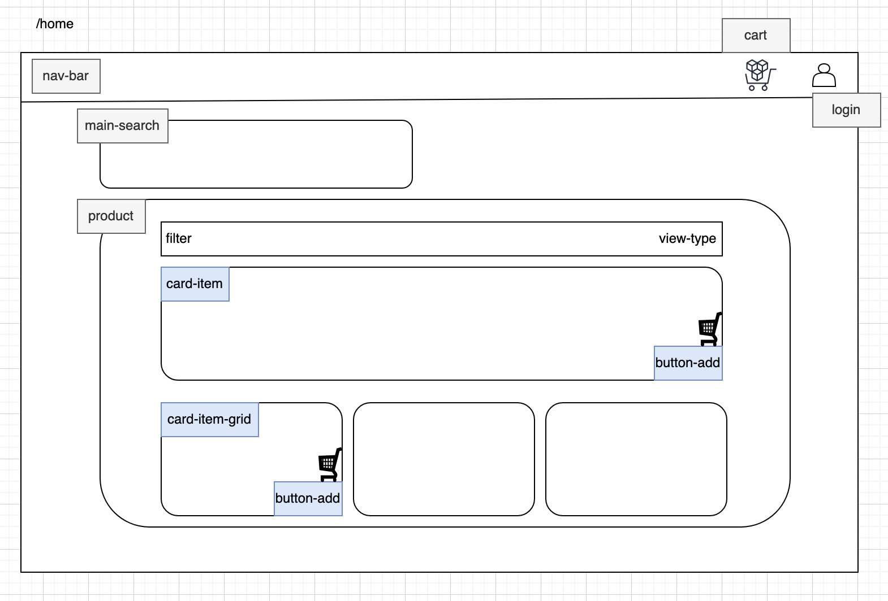

# ShopSystem (ON PROGRESS)

This project was generated with [Angular CLI](https://github.com/angular/angular-cli) version 15.2.6.

The project has the objective to bring a compilation of top technologies that we study, the market asks, but it rarely use it daily.

For that I will implement a Shop System, with its main functionalities like cards, cart, products list, etc. This is a hands on project.

	Global project in phases

	1 - System Definitions
	Architecture
	Code Patterns
	Clean Code

	2 - Front-end - SPA
	Angular
	TypeScript
	Rxjs
	Ngrx
	Jasmine
	PrimeNG
	CDD

	3 - Back-end
	Node.js
	TypeScript
	DDD
	RabitMQ ?
	gRPC ?
	DB	Mongo ?

	4 - App Host
	AWS ?

## NGRX Flow for Cart

## Home Components Architecture

## Development server

Run `ng serve` for a dev server. Navigate to `http://localhost:4200/`. The application will automatically reload if you change any of the source files.

## Code scaffolding

Run `ng generate component component-name` to generate a new component. You can also use `ng generate directive|pipe|service|class|guard|interface|enum|module`.

## Build

Run `ng build` to build the project. The build artifacts will be stored in the `dist/` directory.

## Running unit tests

Run `ng test` to execute the unit tests via [Karma](https://karma-runner.github.io).

## Running end-to-end tests

Run `ng e2e` to execute the end-to-end tests via a platform of your choice. To use this command, you need to first add a package that implements end-to-end testing capabilities.

## Further help

To get more help on the Angular CLI use `ng help` or go check out the [Angular CLI Overview and Command Reference](https://angular.io/cli) page.

